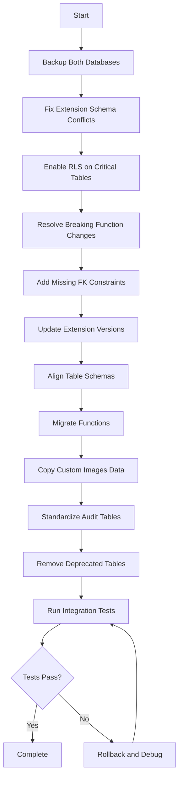

# Database Transformation Plan: Non-Prod to Production Synchronization

**Generated:** 2025-10-15
**Author:** Database Analysis Tool
**Non-Prod Project:** icraft non-prod (jjpbogjufnqzsgiiaqwn)
**Production Project:** icraft prod (lgkjfymwvhcjvfkuidis)

---

## Executive Summary

This document outlines the differences between the non-production and production Supabase database instances and provides a detailed transformation plan to synchronize production with non-prod enhancements.

### Key Findings

- **Tables:** 2 deprecated tables exist in non-prod that should NOT be migrated to production
- **Extensions:** Version mismatches in 2 extensions (supabase_vault, wrappers)
- **Migrations:** 43 additional migrations in non-prod (181 vs 138 in production)
- **Functions:** 14 function signature differences requiring careful migration
- **Row Count Differences:** Significant data volume differences in several tables

### Risk Assessment

- **Overall Risk:** MEDIUM-HIGH
- **Primary Risks:**
  - Migration order dependencies
  - Function signature incompatibilities
  - Extension version conflicts
  - Data loss if deprecated tables are referenced

---

## 1. Database Environment Overview

### Non-Production (jjpbogjufnqzsgiiaqwn)
- **Region:** us-east-2
- **PostgreSQL Version:** 15.8.1.044
- **Tables:** 30 (including 2 deprecated)
- **Migrations:** 181
- **Last Migration:** 20251007044535
- **Status:** ACTIVE_HEALTHY

### Production (lgkjfymwvhcjvfkuidis)
- **Region:** us-east-2
- **PostgreSQL Version:** 15.8.1.093
- **Tables:** 28
- **Migrations:** 138
- **Last Migration:** 20251007044651
- **Status:** ACTIVE_HEALTHY

---

## 2. Schema Differences Analysis

### 2.1 Table Structure Differences

#### Tables in Non-Prod NOT in Production (DO NOT MIGRATE)

1. **`stories_original`** (0 rows) - DEPRECATED
   - Comment: "This is a duplicate of stories"
   - **Action:** Do NOT migrate to production
   - **Reason:** Deprecated table, no longer in use

2. **`community_stories_old`** (0 rows) - DEPRECATED
   - **Action:** Do NOT migrate to production
   - **Reason:** Replaced by `community_stories` table

#### Column Differences in Existing Tables

##### **user_profiles**
| Column | Non-Prod | Production | Issue |
|--------|----------|------------|-------|
| `language` | `CHECK: language = ANY (ARRAY['en', 'es', 'es-419'])` | Default: `'en'::character varying` | Constraint difference |
| `rls_enabled` | false | true | **CRITICAL: RLS mismatch** |

##### **stories**
| Column | Non-Prod | Production | Issue |
|--------|----------|------------|-------|
| `rls_enabled` | false | true | **CRITICAL: RLS mismatch** |
| `original_user_id` | Missing FK constraint | Has FK to user_profiles | **Missing constraint in non-prod** |
| `last_modified_by` | Missing FK constraint | Has FK to user_profiles | **Missing constraint in non-prod** |

##### **team_invitations**
| Column | Non-Prod | Production | Issue |
|--------|----------|------------|-------|
| `id` | text (uuid default) | uuid | Type mismatch |
| `invited_user_id` | Missing | Present (text, nullable) | **Missing column in non-prod** |
| `token` | Missing | Present (text, unique) | **Missing column in non-prod** |
| `updated_at` | Missing | Present (timestamp) | **Missing column in non-prod** |

##### **gen_ai_details**
| Column | Non-Prod | Production | Issue |
|--------|----------|------------|-------|
| `id` | Primary key | Primary key | OK |
| `story_id` | nullable, no FK | Has FK to stories.id | **Missing FK constraint in non-prod** |
| `story_params` | Present | Missing | **Extra column in non-prod** |
| `story_response` | Present | Missing | **Extra column in non-prod** |
| `generation_type` | Missing | Present | **Missing column in non-prod** |
| `prompt` | Missing | Present | **Missing column in non-prod** |
| `model_used` | Missing | Present | **Missing column in non-prod** |
| `settings` | Missing | Present (jsonb, default '{}') | **Missing column in non-prod** |
| `created_at` | Present | Present | OK |

##### **categories**
| Column | Non-Prod | Production | Issue |
|--------|----------|------------|-------|
| `updated_at` | Present | Missing | **Extra column in non-prod** |

##### **subscription_events**
| Column | Non-Prod | Production | Issue |
|--------|----------|------------|-------|
| `subscription_id` | nullable uuid | nullable, text type | **Type mismatch** |
| `user_id` | Missing | Present (uuid) | **Missing column in non-prod** |

##### **reconciliation_jobs**
| Column | Non-Prod | Production | Issue |
|--------|----------|------------|-------|
| `errors_found` | Present | Missing (renamed to discrepancies_found) | **Schema mismatch** |
| `discrepancies_fixed` | Present | Missing | **Extra column in non-prod** |
| `error_details` | Present (jsonb) | Missing (renamed to error_message text) | **Schema mismatch** |

##### **consistency_violations**
| Column | Non-Prod | Production | Issue |
|--------|----------|------------|-------|
| `local_state` | Present | Missing (renamed to expected_state) | **Schema mismatch** |
| `stripe_state` | Present | Missing (renamed to actual_state) | **Schema mismatch** |
| `discrepancy_details` | Present | Missing | **Extra column in non-prod** |
| `resolved_by` | Present (text) | Missing (renamed to resolution_notes) | **Schema mismatch** |
| `resolution_method` | Present | Missing | **Extra column in non-prod** |
| `severity` | Present | Present | OK |
| `resolved` | Missing | Present (boolean, default false) | **Missing column in non-prod** |

##### **webhook_idempotency**
| Column | Non-Prod | Production | Issue |
|--------|----------|------------|-------|
| `operation_type` | Present | Missing | **Extra column in non-prod** |
| `operation_result` | Present (jsonb) | Missing | **Extra column in non-prod** |
| `response_status` | Missing | Present (integer) | **Missing column in non-prod** |
| `response_body` | Missing | Present (text) | **Missing column in non-prod** |
| `expires_at` | Present | Missing | **Extra column in non-prod** |

##### **webhook_events**
| Column | Non-Prod | Production | Issue |
|--------|----------|------------|-------|
| `source` | Default 'stripe' | Default 'stripe' | OK |
| `updated_at` | Present | Missing | **Extra column in non-prod** |

### 2.2 Extension Differences

| Extension | Non-Prod Version | Prod Version | Schema (Non-Prod) | Schema (Prod) | Action Required |
|-----------|------------------|--------------|-------------------|---------------|-----------------|
| **supabase_vault** | 0.2.8 | 0.3.1 | vault | vault | Update non-prod OR downgrade prod |
| **wrappers** | 0.4.4 | 0.5.0 | extensions | extensions | Update non-prod OR downgrade prod |
| **vector** | 0.8.0 | 0.8.0 | public | extensions | **Schema mismatch - CRITICAL** |
| **pgjwt** | 0.2.0 | 0.2.0 | extensions | (no schema info) | Verify schema placement |

**CRITICAL:** The `vector` extension is installed in different schemas between environments. This could cause function resolution issues.

---

## 3. Function and Stored Procedure Differences

### 3.1 Functions Missing in Production (Present in Non-Prod)

1. **`allocate_subscription_credits`**
   - Signature: `(p_user_id text, p_plan_id text, p_subscription_id text, p_billing_interval text) → void`
   - **Action:** Verify if this is replaced by other allocation functions in prod

2. **`create_team_credits`** (trigger function)
   - **Action:** Check if this trigger is still needed in production

3. **`fix_story_ownership_from_audit`**
   - Signature: `(p_limit integer, p_time_window_minutes integer, p_dry_run boolean) → record`
   - **Action:** Determine if this admin utility is needed in production

4. **`generate_title_from_filename`**
   - Signature: `(filename text) → text`
   - **Action:** Production has `generate_english_title` instead - verify equivalence

5. **`get_featured_images_i18n`**
   - Signature: `(p_language text, p_limit integer) → record`
   - **Action:** This might be a new feature - verify if needed in production

6. **`update_embeddings_batch`**
   - Signature: `(updates jsonb) → record`
   - **Action:** Required for vector embedding batch updates - migrate to prod

7. **Vector extension functions** (all `halfvec_*`, `sparsevec_*`, array conversion functions)
   - **Action:** These are part of pgvector extension - ensure proper migration

### 3.2 Function Signature Differences

#### **check_missed_webhooks**
- **Non-Prod:** `(hours_back integer) → jsonb`
- **Production:** `() → jsonb`
- **Issue:** Parameter mismatch - non-prod version more flexible
- **Action:** Update production to accept time window parameter

#### **process_credit_purchase_webhook**
- **Non-Prod:** `(event_data jsonb, idempotency_key text, webhook_event_id uuid) → jsonb`
- **Production:** `(p_webhook_event_id uuid, p_user_id uuid, p_payment_data jsonb, p_credits_purchased integer) → jsonb`
- **Issue:** Complete signature change
- **Action:** **CRITICAL - API breaking change** - requires careful migration strategy

#### **remove_story_from_team**
- **Non-Prod:** `(p_story_id uuid, p_user_id text) → jsonb`
- **Production:** `(p_story_id uuid, p_user_id text) → bool`
- **Issue:** Return type mismatch
- **Action:** Standardize return type (jsonb preferred for error details)

#### **validate_credit_transfer**
- **Non-Prod:** `(p_from_user_id text, p_to_team_id text, p_amount integer) → jsonb`
- **Production:** `(p_from_type text, p_to_type text, p_from_id text, p_to_id text, p_user_id text, p_amount integer) → bool`
- **Issue:** Different signature and return type
- **Action:** Migrate production signature to non-prod (prod version more flexible)

#### **get_current_user_id**
- **Non-Prod:** `() → uuid`
- **Production:** `() → text`
- **Issue:** Return type mismatch
- **Action:** Standardize to text (matches Clerk ID format)

#### **update_stripe_customer_id**
- **Non-Prod:** 6 parameters
- **Production:** 7 parameters (adds `p_idempotency_key text`)
- **Issue:** Missing idempotency support in non-prod
- **Action:** Add idempotency parameter to non-prod function

### 3.3 Functions Missing in Non-Prod (Present in Production)

1. **`generate_english_title`**
   - Signature: `(p_r2_key text) → text`
   - **Action:** This appears to replace `generate_title_from_filename`

2. **`process_subscription_state_change_with_teams`**
   - Signature: Complex subscription state change handler
   - **Action:** Verify if this is a production-only feature or should be in non-prod

---

## 4. Migration History Analysis

### 4.1 Migration Count Comparison

- **Non-Prod:** 181 migrations
- **Production:** 138 migrations
- **Difference:** 43 migrations

### 4.2 Migration Gaps

#### Migrations in Non-Prod NOT in Production

The following migrations exist in non-prod but not in production:

**Legacy Database Structural Migrations (2025-07-28 to 2025-07-30):**
- `20250728084219_legacy_database_structural_upgrade`
- `20250728084234_add_activities_foreign_key_constraint`
- `20250730015513_add_timestamp_columns_to_subscriptions`
- `20250730015554_fix_activities_foreign_key_constraints`
- `20250730091713_add_stripe_stored_procedures`
- `20250730091930_add_missing_stripe_functions`
- `20250730091951_add_missing_core_functions`
- `20250730114019_standardize_get_user_subscription_details`
- Multiple subscription-related fixes

**Webhook Infrastructure (2025-07-31 to 2025-08-01):**
- `20250731054832_webhook_infrastructure`
- `20250731054925_atomic_subscription_procedures`
- `20250731055223_reconciliation_procedures`
- `20250731065606_teams_credit_balance_integration`
- Multiple credit management fixes

**Image Import Batches (2025-09-05):**
- `17_import_batch_16` through `24_import_batch_23`
- Multiple custom image import batches

**Custom Images Infrastructure (2025-09-05 to 2025-09-08):**
- `01_remove_duplicate_images` through `07_enable_vector_search`
- Multiple vector search setup migrations

**Vector Search Enhancements (2025-09-07 to 2025-09-13):**
- `add_pgvector_embeddings`
- `create_vector_search_function`
- `add_query_embedding_to_search_function`
- `create_batch_update_embeddings_function`

**Bug Fixes (2025-09-17, 2025-10-03, 2025-10-05):**
- `fix_allocate_trial_credits_uuid_bug`
- `fix_scheduled_subscription_sync_null_constraint`
- `fix_allocate_monthly_credits_uuid_type`
- `fix_community_stories_sort_order` (v1 and v2)

#### Migrations in Production NOT in Non-Prod

The following migrations exist in production but not in non-prod:

**Initial Setup Migrations (2025-06-05):**
- `20250605083723_add_missing_story_fields`
- `20250605090551_create_get_paginated_community_stories_function`
- `20250605090659_update_community_stories_schema`
- Multiple function migration batches

**Credit Transfer Feature (2025-06-10):**
- `20250610022435_create_credit_transfers_table`
- `20250610022909_update_credit_transfer_validation`

**Team Invitations (2025-06-10):**
- `20250610120444_setup_team_invitations_complete`

**Subscription Management (2025-07-31 to 2025-08-01):**
- Different versions of webhook and subscription procedures
- Production has consolidated versions

**Image Management (2025-09-05 to 2025-09-13):**
- Different batch numbering and organization
- Production has `improve_text_search_for_special_chars`
- Production has `revert_to_original_vector_search`

### 4.3 Migration Divergence Point

The migration histories diverged around **2025-05-22** with the initial setup. Production and non-prod took different evolutionary paths:

- **Production:** Focused on production-ready features, team collaboration
- **Non-Prod:** Experimental features, vector search enhancements, image batching

---

## 5. Data Volume Differences

### Tables with Significant Row Count Differences

| Table | Non-Prod Rows | Prod Rows | Variance | Notes |
|-------|---------------|-----------|----------|-------|
| **user_profiles** | 231 | 11 | +220 | Non-prod has test users |
| **stories** | 317 | 0 | +317 | Non-prod has development stories |
| **activities** | 5,920 | 8 | +5,912 | Activity logs in non-prod |
| **community_stories** | 104 | 0 | +104 | Community content in non-prod |
| **subscriptions** | 15 | 1 | +14 | Test subscriptions in non-prod |
| **credit_transactions** | 264 | 10 | +254 | Testing activity in non-prod |
| **sync_metadata** | 530 | 16 | +514 | Device sync testing |
| **gen_ai_details** | 22 | 0 | +22 | AI generation testing |
| **sync_deleted_log** | 23 | 0 | +23 | Deletion tracking |
| **custom_images** | 0 | 4,458 | -4,458 | **Production ahead** |
| **custom_images_translations** | 0 | 8,916 | -8,916 | **Production ahead** |
| **categories** | 0 | 16 | -16 | **Production ahead** |
| **categories_translations** | 0 | 32 | -32 | **Production ahead** |
| **system_logs** | 1,647 | 1,240 | +407 | More logging in non-prod |
| **system_alerts** | 9 | 49 | -40 | **More alerts in prod** |
| **subscription_events** | 28 | 0 | +28 | Testing events in non-prod |

**KEY INSIGHT:** Production database has complete custom images infrastructure (4,458 images with translations), while non-prod has none. This suggests the image migration was completed in production but not non-prod.

---

## 6. Transformation Plan

### 6.1 Prioritized Action Items

#### PRIORITY 1: CRITICAL (Must Fix Before Any Migration)

1. **Resolve Extension Schema Conflicts**
   - **Issue:** `vector` extension in different schemas
   - **Action:**
     ```sql
     -- In production, move vector to public schema to match non-prod
     -- OR in non-prod, move vector to extensions schema to match prod
     -- Recommended: Standardize on extensions schema
     ```
   - **Risk:** HIGH - Function resolution failures
   - **Estimated Time:** 30 minutes

2. **Fix RLS Mismatch on Critical Tables**
   - **Tables:** user_profiles, stories
   - **Issue:** Non-prod has RLS disabled, production has it enabled
   - **Action:** Enable RLS in non-prod and test thoroughly
   - **Risk:** HIGH - Security and access control issues
   - **Estimated Time:** 2 hours (including testing)

3. **Resolve Function Signature Breaking Changes**
   - **Functions:**
     - `process_credit_purchase_webhook` - Complete rewrite needed
     - `validate_credit_transfer` - Signature incompatible
   - **Action:** Create migration strategy with backward compatibility
   - **Risk:** CRITICAL - API consumers will break
   - **Estimated Time:** 4 hours

#### PRIORITY 2: HIGH (Required for Feature Parity)

4. **Migrate Missing Foreign Key Constraints**
   - **Tables:** stories (original_user_id, last_modified_by), gen_ai_details
   - **Action:** Add FK constraints in non-prod to match production
   - **Risk:** MEDIUM - May fail if data integrity issues exist
   - **Estimated Time:** 1 hour

5. **Standardize `team_invitations` Schema**
   - **Missing columns:** invited_user_id, token, updated_at
   - **Action:** Alter table in non-prod to add missing columns
   - **Risk:** MEDIUM - Existing code may not populate new columns
   - **Estimated Time:** 1 hour

6. **Align `gen_ai_details` Schema**
   - **Issue:** Completely different column sets
   - **Action:** Determine authoritative schema and migrate
   - **Risk:** HIGH - AI generation feature may break
   - **Estimated Time:** 3 hours

7. **Update Extension Versions**
   - **Extensions:** supabase_vault (0.2.8 → 0.3.1), wrappers (0.4.4 → 0.5.0)
   - **Action:** Update non-prod extensions to match production
   - **Risk:** LOW-MEDIUM - Extension API changes
   - **Estimated Time:** 1 hour

#### PRIORITY 3: MEDIUM (Feature Completeness)

8. **Migrate Custom Images Infrastructure**
   - **Issue:** Production has 4,458 images, non-prod has 0
   - **Action:** Replicate custom_images, translations, and categories to non-prod
   - **Risk:** LOW - Data copy operation
   - **Estimated Time:** 2 hours

9. **Sync Missing Functions**
   - Functions: `update_embeddings_batch`, `get_featured_images_i18n`, etc.
   - **Action:** Create functions in production from non-prod
   - **Risk:** LOW - New functions, no conflicts
   - **Estimated Time:** 2 hours

10. **Standardize Audit Table Schemas**
    - **Tables:** reconciliation_jobs, consistency_violations, webhook_idempotency
    - **Action:** Align column names and types
    - **Risk:** LOW - Audit/logging tables
    - **Estimated Time:** 1 hour

#### PRIORITY 4: LOW (Cleanup and Optimization)

11. **Remove Deprecated Tables from Non-Prod**
    - **Tables:** stories_original, community_stories_old
    - **Action:** Drop tables if confirmed unused
    - **Risk:** VERY LOW - Tables are empty and marked deprecated
    - **Estimated Time:** 15 minutes

12. **Sync Test Data (Optional)**
    - **Action:** Optionally copy sanitized production data to non-prod for testing
    - **Risk:** LOW - Data copy operation
    - **Estimated Time:** Variable (depends on data volume)

### 6.2 Migration Sequence



### 6.3 Detailed Migration Scripts

#### Script 1: Extension Schema Standardization

```sql
-- Run in PRODUCTION to move vector extension to public schema
-- (Matches non-prod configuration)

BEGIN;

-- Drop extension from extensions schema
DROP EXTENSION IF EXISTS vector CASCADE;

-- Recreate in public schema
CREATE EXTENSION IF NOT EXISTS vector SCHEMA public VERSION '0.8.0';

-- Verify placement
SELECT
    e.extname,
    n.nspname AS schema,
    e.extversion
FROM pg_extension e
JOIN pg_namespace n ON n.oid = e.extnamespace
WHERE e.extname = 'vector';

COMMIT;

-- Run integration tests after this change
```

**Alternative:** Update non-prod to use extensions schema (recommended for Supabase best practices)

```sql
-- Run in NON-PROD to move vector extension to extensions schema
-- (Matches production configuration)

BEGIN;

-- Drop extension from public schema
DROP EXTENSION IF EXISTS vector CASCADE;

-- Recreate in extensions schema
CREATE EXTENSION IF NOT EXISTS vector SCHEMA extensions VERSION '0.8.0';

-- Update function search paths if needed
-- (Check all functions using vector types)

COMMIT;
```

#### Script 2: Enable RLS on Critical Tables (Non-Prod)

```sql
-- Run in NON-PROD to enable RLS

BEGIN;

-- Enable RLS on user_profiles
ALTER TABLE public.user_profiles ENABLE ROW LEVEL SECURITY;

-- Enable RLS on stories
ALTER TABLE public.stories ENABLE ROW LEVEL SECURITY;

-- Verify RLS policies exist
SELECT
    schemaname,
    tablename,
    policyname,
    cmd,
    qual
FROM pg_policies
WHERE tablename IN ('user_profiles', 'stories');

-- If policies are missing, create them to match production
-- (Review production policies first)

COMMIT;
```

#### Script 3: Add Missing Foreign Keys (Non-Prod)

```sql
-- Run in NON-PROD to add FK constraints

BEGIN;

-- Add FK for stories.original_user_id
ALTER TABLE public.stories
ADD CONSTRAINT stories_original_user_id_fkey
FOREIGN KEY (original_user_id)
REFERENCES public.user_profiles(id)
ON DELETE SET NULL;

-- Add FK for stories.last_modified_by
ALTER TABLE public.stories
ADD CONSTRAINT stories_last_modified_by_fkey
FOREIGN KEY (last_modified_by)
REFERENCES public.user_profiles(id)
ON DELETE SET NULL;

-- Add FK for gen_ai_details.story_id
ALTER TABLE public.gen_ai_details
ADD CONSTRAINT gen_ai_details_story_id_fkey
FOREIGN KEY (story_id)
REFERENCES public.stories(id)
ON DELETE CASCADE;

COMMIT;
```

#### Script 4: Standardize team_invitations Schema (Non-Prod)

```sql
-- Run in NON-PROD to add missing columns

BEGIN;

-- Change id type from text to uuid
ALTER TABLE public.team_invitations
ALTER COLUMN id TYPE uuid USING id::uuid;

-- Add missing columns
ALTER TABLE public.team_invitations
ADD COLUMN IF NOT EXISTS invited_user_id text;

ALTER TABLE public.team_invitations
ADD COLUMN IF NOT EXISTS token text UNIQUE DEFAULT encode(extensions.gen_random_bytes(32), 'base64url');

ALTER TABLE public.team_invitations
ADD COLUMN IF NOT EXISTS updated_at timestamp without time zone DEFAULT now();

-- Create index on token for performance
CREATE INDEX IF NOT EXISTS idx_team_invitations_token ON public.team_invitations(token);

COMMIT;
```

#### Script 5: Update Extension Versions (Non-Prod)

```sql
-- Run in NON-PROD to update extensions

BEGIN;

-- Update supabase_vault
ALTER EXTENSION supabase_vault UPDATE TO '0.3.1';

-- Update wrappers
ALTER EXTENSION wrappers UPDATE TO '0.5.0';

-- Verify versions
SELECT
    e.extname,
    e.extversion,
    n.nspname AS schema
FROM pg_extension e
JOIN pg_namespace n ON n.oid = e.extnamespace
WHERE e.extname IN ('supabase_vault', 'wrappers');

COMMIT;
```

---

## 7. Risk Mitigation Strategies

### 7.1 Pre-Migration Validation

1. **Full Database Backup**
   ```bash
   # Backup production
   supabase db dump --project-ref lgkjfymwvhcjvfkuidis > prod_backup_$(date +%Y%m%d).sql

   # Backup non-prod
   supabase db dump --project-ref jjpbogjufnqzsgiiaqwn > nonprod_backup_$(date +%Y%m%d).sql
   ```

2. **Function Dependency Analysis**
   ```sql
   -- Identify functions that depend on vector types
   SELECT
       n.nspname as schema,
       p.proname as function_name,
       pg_get_function_identity_arguments(p.oid) as arguments
   FROM pg_proc p
   JOIN pg_namespace n ON n.oid = p.pronamespace
   WHERE pg_get_functiondef(p.oid) LIKE '%vector%'
     AND n.nspname = 'public';
   ```

3. **Data Integrity Checks**
   ```sql
   -- Check for orphaned records before adding FKs
   SELECT COUNT(*) as orphaned_stories
   FROM public.stories s
   WHERE s.original_user_id IS NOT NULL
     AND NOT EXISTS (
       SELECT 1 FROM public.user_profiles up
       WHERE up.id = s.original_user_id
     );
   ```

### 7.2 Rollback Procedures

#### If Extension Migration Fails:
```sql
BEGIN;
DROP EXTENSION vector CASCADE;
CREATE EXTENSION vector SCHEMA public VERSION '0.8.0'; -- or extensions
-- Restore functions from backup
ROLLBACK; -- If issues persist
```

#### If FK Addition Fails:
```sql
-- Remove problematic constraints
ALTER TABLE public.stories DROP CONSTRAINT IF EXISTS stories_original_user_id_fkey;
-- Fix data integrity issues
-- Retry FK addition
```

#### Complete Rollback:
```bash
# Restore from backup
psql -h db.jjpbogjufnqzsgiiaqwn.supabase.co \
     -U postgres \
     -d postgres \
     < nonprod_backup_YYYYMMDD.sql
```

### 7.3 Testing Checklist

- [ ] Extension versions match and functions resolve correctly
- [ ] RLS policies enforce proper access control
- [ ] FK constraints don't block valid operations
- [ ] All migrated functions execute without errors
- [ ] API endpoints using updated functions work correctly
- [ ] Vector search functionality works in both environments
- [ ] Webhook processing functions handle events correctly
- [ ] Credit allocation and subscription sync work as expected
- [ ] Team collaboration features function properly
- [ ] Image search returns results correctly

---

## 8. Post-Migration Validation

### 8.1 Schema Validation Queries

```sql
-- Compare table counts
SELECT
    'non-prod' as environment,
    COUNT(*) as table_count
FROM information_schema.tables
WHERE table_schema = 'public'
  AND table_type = 'BASE TABLE'
UNION ALL
SELECT
    'production' as environment,
    COUNT(*) as table_count
FROM information_schema.tables
WHERE table_schema = 'public'
  AND table_type = 'BASE TABLE';

-- Compare function counts
SELECT
    'non-prod' as environment,
    COUNT(*) as function_count
FROM pg_proc p
JOIN pg_namespace n ON n.oid = p.pronamespace
WHERE n.nspname = 'public'
  AND p.prokind IN ('f', 'p');

-- Verify critical constraints exist
SELECT
    tc.table_name,
    tc.constraint_name,
    tc.constraint_type
FROM information_schema.table_constraints tc
WHERE tc.table_schema = 'public'
  AND tc.constraint_type = 'FOREIGN KEY'
  AND tc.table_name IN ('stories', 'gen_ai_details', 'team_invitations')
ORDER BY tc.table_name, tc.constraint_name;
```

### 8.2 Functional Testing

1. **Test Credit Operations**
   ```sql
   -- Verify credit allocation works
   SELECT use_credits_for_operation(
     'test_user_id',
     'story_generation',
     NULL,
     1,
     '{}'::jsonb
   );
   ```

2. **Test Vector Search**
   ```sql
   -- Verify vector search works
   SELECT * FROM search_custom_images_vector(
     'nature',
     'en',
     NULL,
     1,
     10,
     'created_at',
     true,
     NULL,
     0.3
   );
   ```

3. **Test Subscription Sync**
   ```sql
   -- Test subscription sync
   SELECT scheduled_subscription_sync();
   ```

---

## 9. Timeline and Resource Allocation

### 9.1 Estimated Timeline

| Phase | Duration | Dependencies |
|-------|----------|--------------|
| **Preparation** | 2 hours | Database backups, analysis review |
| **Extension Fix** | 30 min | - |
| **RLS Configuration** | 2 hours | Extension fix complete |
| **Function Migration** | 4 hours | Extension fix complete |
| **Schema Alignment** | 4 hours | RLS complete |
| **Data Migration** | 2 hours | Schema alignment complete |
| **Testing** | 4 hours | All migrations complete |
| **Buffer** | 2 hours | Unexpected issues |
| **Total** | ~20 hours | Spread over 3-4 days |

### 9.2 Required Resources

- **Database Administrator:** 1 person, full-time during migration
- **Backend Developer:** 1 person, available for API testing
- **QA Engineer:** 1 person, for integration testing
- **Downtime Window:** 2-4 hours for production changes (recommend weekend)

---

## 10. Recommendations

### 10.1 Immediate Actions

1. **DO NOT proceed with production migration until:**
   - Extension schema conflicts are resolved
   - RLS implications are fully understood
   - Breaking function changes have migration paths

2. **Start with non-prod updates:**
   - Update non-prod to match production's stable features
   - Test thoroughly in non-prod before touching production

3. **Establish migration governance:**
   - Require migration review before applying to any environment
   - Use Supabase migration CLI for all schema changes
   - Keep migration history synchronized

### 10.2 Long-Term Strategy

1. **Standardize Development Workflow:**
   - All changes start in non-prod
   - Required testing checklist before prod migration
   - Automated schema diff checks in CI/CD

2. **Extension Management:**
   - Pin extension versions in documentation
   - Test extension updates in non-prod first
   - Maintain compatibility matrix

3. **Function Versioning:**
   - Use semantic versioning for function changes
   - Maintain backward compatibility for 1 version
   - Document breaking changes clearly

4. **Monitoring and Alerts:**
   - Set up schema drift detection
   - Alert on migration failures
   - Track function execution errors

---

## 11. Conclusion

The non-prod and production databases have diverged significantly, with 43 migration differences and critical schema mismatches. The most concerning issues are:

1. Extension schema conflicts that could break functionality
2. RLS configuration differences affecting security
3. Breaking function signature changes
4. Missing foreign key constraints

**Recommendation:** DO NOT perform a bulk synchronization. Instead, follow the prioritized transformation plan, starting with critical fixes and thoroughly testing each phase.

**Next Steps:**
1. Review this document with the development team
2. Prioritize which features to migrate (non-prod → prod vs prod → non-prod)
3. Create detailed test plans for each priority level
4. Schedule migration windows with appropriate stakeholder communication
5. Execute Priority 1 items first, validate, then proceed

---

**Document Version:** 1.0
**Last Updated:** 2025-10-15
**Status:** Draft for Review
